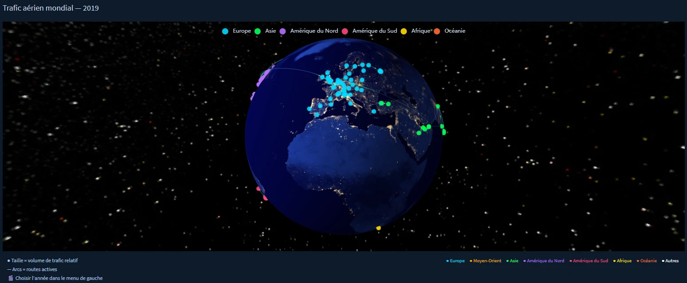
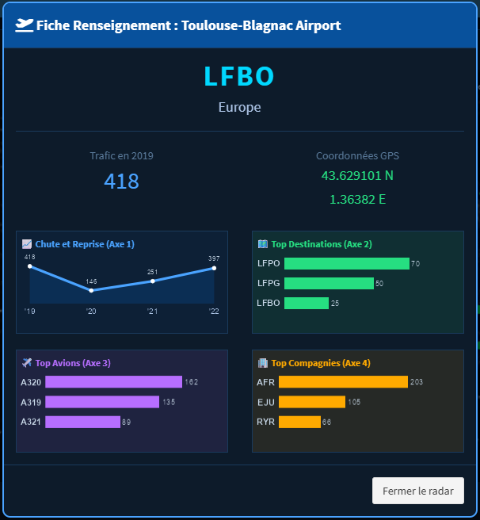

```{r setup, include=FALSE}
# Tout le code est masqué dans le rapport (echo = FALSE) mais reste exécuté :
# le rapport est donc reproductible. Le fichier de code seul s'obtient avec
#   knitr::purl("rapport_final.Rmd", output = "rapport_final_code.R", documentation = 0)
knitr::opts_chunk$set(
  echo = FALSE, message = FALSE, warning = FALSE,
  fig.align = "center", fig.width = 9, fig.height = 5, dpi = 110
)
library(tidyverse)
library(lubridate)
library(scales)
library(geosphere)
library(ggrepel)
library(ggridges)
library(maps)
library(viridis)
```

```{r donnees, include=FALSE}
# --- Chargement des données (une seule fois) ---
flights_all <- read_csv("data/clean/clean_COVID_19_Flightfile_entier.csv") %>%
  mutate(date = as.Date(day), annee = year(date),
         mois_num = month(date), mois_date = floor_date(date, "month"))

flights_2019 <- read_csv("data/clean/clean_COVID_19_Flightfile_2019.csv")

airports_raw <- read_csv("data/clean/airports.csv")

airports_coord <- airports_raw %>%
  filter(!is.na(icao_code), !is.na(latitude_deg), !is.na(longitude_deg)) %>%
  distinct(icao_code, .keep_all = TRUE) %>%
  select(icao_code, latitude_deg, longitude_deg)

# na = c("") : préserve "NA" (Amérique du Nord) au lieu de le lire comme manquant
airports_cont <- read_csv("data/clean/airports.csv", na = c("")) %>%
  filter(!is.na(icao_code), !is.na(continent), !(continent %in% c("AN", ""))) %>%
  distinct(icao_code, .keep_all = TRUE) %>%
  select(icao_code, continent) %>%
  mutate(continent_label = recode(continent,
    "AF" = "Afrique", "AS" = "Asie", "EU" = "Europe",
    "NA" = "Amérique du Nord", "SA" = "Amérique du Sud", "OC" = "Océanie"))

airlines_clean <- tribble(
  ~icao, ~name,                 ~modele,
  "SWA", "Southwest Airlines",  "Low-cost",
  "RYR", "Ryanair",             "Low-cost",
  "EZY", "easyJet",             "Low-cost",
  "WZZ", "Wizz Air",            "Low-cost",
  "VLG", "Vueling",             "Low-cost",
  "DAL", "Delta Air Lines",     "Major réseau",
  "AAL", "American Airlines",   "Major réseau",
  "UAL", "United Airlines",     "Major réseau",
  "DLH", "Lufthansa",           "Major réseau",
  "AFR", "Air France",          "Major réseau",
  "BAW", "British Airways",     "Major réseau",
  "THY", "Turkish Airlines",    "Major réseau",
  "FDX", "FedEx",               "Cargo",
  "UPS", "UPS Airlines",        "Cargo"
)

world <- map_data("world")
```

# Introduction

Ce rapport présente l'analyse complète du **trafic aérien mondial entre 2019 et 2022**, à partir du
**OpenSky Network COVID-19 Flight Dataset** (plus de 41 millions de vols), croisé avec la base
**OurAirports** (coordonnées et métadonnées des aéroports).

Pour garder un volume exploitable en R tout en couvrant l'ensemble de la période, nous travaillons sur un
**échantillon aléatoire** : **1 %** pour chaque fichier annuel (2019–2022) et **~0,3 %** pour le fichier
complet 2019–2022 (~352 000 vols). Un tirage aléatoire conserve les tendances d'ensemble ; seules les
analyses sur de très petits sous-groupes sont à interpréter avec prudence.

L'analyse s'articule autour de **quatre axes** et **neuf questions**. Elle est accompagnée d'une application
Shiny interactive (globe 3D + onglets par axe) ; ce rapport en restitue les principaux résultats.

## Plan d'analyse

- **Axe 1 — Le pouls du ciel** (dynamiques temporelles) : Q1 série temporelle 2019-2022 · Q2 rythme horaire / hebdomadaire / saisonnier.
- **Axe 2 — La géographie du ciel** (les flux) : Q3 corridors aériens · Q4 hubs et connectivité · Q5 impact régional du COVID.
- **Axe 3 — Les machines** (la flotte) : Q6 types d'aéronefs et constructeurs · Q7 distances court / moyen / long-courrier.
- **Axe 4 — Les compagnies** (stratégies et résilience) : Q8 résistance à la crise · Q9 réseaux hub vs point-à-point.

> **Note de lecture.** Le code R qui produit chaque figure est volontairement masqué pour la lisibilité ;
> il reste présent dans le fichier source `rapport_final.Rmd` (rapport entièrement reproductible).

---

# Traitement des données

## Source principale : OpenSky Network

L’analyse repose sur les données de vols issues de la base OpenSky Network, qui recense plus de 41 millions de vols à l’échelle mondiale. Afin de rendre les traitements compatibles avec les contraintes de calcul et de stockage, un échantillonnage aléatoire a été réalisé sur les données des années 2019 à 2022.

Quatre jeux de données (un par année) ont ainsi été constitués, chacun représentant environ 1 % des observations annuelles disponibles. De plus, un jeu de données général regroupant les quatre années a été créé ; il représente environ 0,3 % du volume total initial. Cette réduction permet une manipulation fluide des données et facilite le partage du projet via GitHub, tout en conservant une représentation globale des tendances observées.

L’échantillonnage a été effectué de manière aléatoire en fixant une graine aléatoire (*random seed*), garantissant ainsi la reproductibilité des résultats obtenus. Il convient toutefois de noter que toute procédure d’échantillonnage peut conserver, voire accentuer les biais déjà présents dans les données d’origine.

## Source complémentaire : OurAirports

Les informations relatives aux aéroports proviennent de la base de données OurAirports, qui répertorie environ 78 000 infrastructures aéroportuaires à travers le monde. Cette source a été utilisée afin d’enrichir les données de vols par des informations descriptives sur les aéroports.

La fusion des deux bases a été réalisée à partir des codes IATA des aéroports. Le code OACI (ICAO) n’étant pas disponible dans les données OpenSky utilisées, il n’a pas pu être retenu comme clé de jointure.

Les aéroports ne disposant pas d’un code IATA ont donc été supprimés lors de la phase de fusion. Cette restriction a un impact limité sur l’analyse, celle-ci portant principalement sur les grands aéroports du réseau aérien mondial, qui possèdent tous un code IATA.

---

<<<<<<< HEAD
# L'application Shiny — exploration interactive

Au-delà des graphiques statiques de ce rapport, nous avons développé une **application Shiny** (dossier `shiny/`) centrée sur un **globe terrestre 3D interactif**. Les deux figures ci-dessous en sont des captures d'écran : **elles ne sont pas générées dans ce rapport mais dans l'application**, que le lecteur est invité à lancer pour interagir avec ces visualisations.

```{r globe-shiny, echo=FALSE, out.width="100%", fig.cap="Application Shiny — globe 3D du trafic aérien mondial (2019). Capture d'écran (figure non générée dans le rapport)."}

```

Le globe affiche les principaux aéroports — **taille proportionnelle au volume de trafic, couleur par région** — et les routes actives sous forme d'arcs. Un menu permet de **choisir l'année (2019-2022)** et de **filtrer par région** : on visualise immédiatement la forte densité européenne et nord-américaine, ainsi que l'effondrement du trafic pendant le COVID en changeant d'année. Cette vue interactive complète la carte statique des corridors (Q3).

```{r popup-shiny, echo=FALSE, out.width="65%", fig.cap="Application Shiny — fiche interactive d'un aéroport (clic sur Toulouse-Blagnac). Capture d'écran (figure non générée dans le rapport)."}

```

En **cliquant sur un aéroport**, l'utilisateur ouvre une fiche détaillée qui croise les quatre axes du projet : évolution 2019-2022 du trafic (Axe 1), top destinations (Axe 2), avions les plus fréquents (Axe 3) et compagnies dominantes (Axe 4). Pour **Toulouse-Blagnac (LFBO)**, on retrouve par exemple la signature COVID (418 vols en 2019, creux à 146 en 2020, reprise à 397 en 2022), une desserte dominée par Paris (LFPO, LFPG) et la forte présence d'Air France et d'easyJet. Cette interactivité — impossible à rendre dans un document statique — illustre l'intérêt de l'application Shiny.

---

=======
>>>>>>> c7259ad8c70e46ca0b9798ca46511c95ab614275
# Axe 1 — Le pouls du ciel : dynamiques temporelles

## Q1 — Comment le volume de vols a-t-il pulsé entre 2019 et 2022 ?

Nous cherchons ici à reconstruire l'histoire complète du trafic aérien mondial sur la période 2019-2022, en capturant l'effondrement brutal provoqué par la pandémie de COVID-19 et la reprise progressive qui a suivi. Les données couvrent 351 768 vols, issus des quatre années assemblées dans un fichier unique.

**Hypothèse — Un effondrement brutal suivi d'une reprise inégale.** Nous supposons que la crise a provoqué une chute sans précédent du trafic au printemps 2020, avec une reprise inégale selon les saisons et les années, et un retour au niveau de 2019 seulement en 2022.

```{r q1-serie}
monthly_all <- flights_all %>%
  group_by(mois_date) %>%
  summarise(n_flights = n(), .groups = "drop")

events <- tibble(
  date  = as.Date(c("2020-03-15", "2020-12-01", "2021-07-01", "2022-06-01")),
  label = c("Confinements", "Vaccins", "Reprise", "≈ niveau 2019")
)
ymax <- max(monthly_all$n_flights)

ggplot(monthly_all, aes(mois_date, n_flights)) +
  geom_area(fill = "#08519c", alpha = 0.12) +
  geom_line(color = "#08519c", linewidth = 1.2) +
  geom_point(color = "#08519c", size = 1.6) +
  geom_vline(data = events, aes(xintercept = date),
             linetype = "dashed", color = "#d62728", alpha = 0.55) +
  geom_text(data = events, aes(x = date, y = ymax * 1.07, label = label),
            hjust = 0, nudge_x = 6, size = 3.2, color = "#c0392b", fontface = "bold") +
  scale_y_continuous(labels = comma, limits = c(0, ymax * 1.15)) +
  scale_x_date(date_breaks = "6 months", date_labels = "%b %Y") +
  labs(title = "Volume mensuel de vols — 2019-2022", x = NULL, y = "Vols par mois",
       caption = "Source : OpenSky Network COVID-19 Flight Dataset") +
  theme_minimal(base_size = 13) +
  theme(plot.title = element_text(face = "bold"), axis.text.x = element_text(angle = 30, hjust = 1))
```

**Hypothèse validée.** La série temporelle révèle un effondrement historique et brutal du trafic aérien mondial. Après une année 2019 stable et saisonnière, le volume chute de près de 65 % entre février et avril 2020 lors des confinements généralisés, atteignant un plancher de **2 525 vols en avril 2020 contre 7 186 en avril 2019**.

La reprise est progressive et irrégulière : un rebond estival en 2020 est suivi d'un nouveau ralentissement hivernal. C'est à partir de mars 2021, avec le déploiement des vaccins, que la reprise prend un caractère durable. En 2022, le trafic dépasse finalement le niveau de 2019.

**Hypothèse — Une saisonnalité structurelle masquée par le COVID.** En superposant les quatre années sur le même axe de mois, nous cherchons à isoler l'effet COVID de la saisonnalité normale, et à vérifier si 2022 retrouve non seulement le niveau mais aussi le profil de 2019.

```{r q1-superposition, fig.height=4.5}
monthly_year <- flights_all %>%
  group_by(annee, mois_num) %>%
  summarise(n_flights = n(), .groups = "drop") %>%
  mutate(annee = factor(annee))

ggplot(monthly_year, aes(mois_num, n_flights, color = annee, group = annee)) +
  geom_line(linewidth = 1.2) + geom_point(size = 2) +
  scale_color_manual(values = c("2019"="#2196F3","2020"="#F44336","2021"="#FF9800","2022"="#4CAF50")) +
  scale_x_continuous(breaks = 1:12,
    labels = c("Jan","Fév","Mar","Avr","Mai","Jun","Jul","Aoû","Sep","Oct","Nov","Déc")) +
  scale_y_continuous(labels = comma) +
  labs(title = "Saisonnalité comparée 2019-2022", x = NULL, y = "Vols", color = "Année",
       caption = "Source : OpenSky Network") +
  theme_minimal(base_size = 13) + theme(plot.title = element_text(face = "bold"), legend.position = "bottom")
```

**Hypothèse validée.** La superposition met en évidence la rupture brutale de mars 2020 sur la courbe rouge (2020), qui suit le profil 2019 jusqu'en février puis s'effondre. L'année 2021 (orange) repart progressivement en calquant la saisonnalité de 2019. L'année 2022 (vert) dépasse 2019 sur quasiment tous les mois, avec un pic estival record témoignant d'un effet de rattrapage de la demande refoulée pendant la pandémie.

**Hypothèse — Un retour au niveau 2019 seulement en 2022.** Un indice de reprise (base 100 = niveau 2019 mois par mois) permet de quantifier précisément l'ampleur du choc et le rythme du retour à la normale pour chacune des trois années post-crise.

```{r q1-indice, fig.height=4.5}
base_2019 <- monthly_year %>% filter(annee == 2019) %>% select(mois_num, base = n_flights)
reprise <- monthly_year %>% filter(annee != 2019) %>%
  left_join(base_2019, by = "mois_num") %>% mutate(indice = n_flights / base * 100)

ggplot(reprise, aes(mois_num, indice, color = annee, group = annee)) +
  geom_hline(yintercept = 100, linetype = "dashed", color = "gray50", linewidth = 0.8) +
  geom_line(linewidth = 1.2) + geom_point(size = 2) +
  scale_color_manual(values = c("2020"="#F44336","2021"="#FF9800","2022"="#4CAF50")) +
  scale_x_continuous(breaks = 1:12,
    labels = c("Jan","Fév","Mar","Avr","Mai","Jun","Jul","Aoû","Sep","Oct","Nov","Déc")) +
  scale_y_continuous(labels = function(x) paste0(x, "%")) +
  labs(title = "Indice de reprise (base 100 = niveau 2019)", x = NULL,
       y = "Indice de reprise (%)", color = "Année", caption = "Source : OpenSky Network") +
  theme_minimal(base_size = 13) + theme(plot.title = element_text(face = "bold"), legend.position = "bottom")
```

**Hypothèse validée — dépassement de 2019 dès mars 2022.** En avril 2020, le trafic ne représentait que 35 % du niveau de 2019, soit une perte de 65 points d'indice en deux mois. La reprise de 2021 est lente et hésitante en première moitié d'année (55-75 %), avant de s'accélérer à partir de l'été (85-90 %).

C'est en 2022 que le dépassement devient visible : dès mars, l'indice franchit la barre des 100 %, et le pic estival 2022 atteint environ 110-115 % du niveau de 2019, témoignant d'un véritable effet de rattrapage.

**Conclusion — Q1.** L'analyse de la série temporelle 2019-2022 dresse le portrait d'une crise sans précédent dans l'histoire de l'aviation commerciale. La chute de 65 % du trafic en quelques semaines au printemps 2020 n'a aucun équivalent historique. La reprise a été asymétrique : rapide sur le segment loisirs dès l'été 2020, beaucoup plus lente sur le trafic d'affaires international, qui n'a retrouvé son niveau qu'en 2022.

## Q2 — Le trafic aérien a-t-il un rythme cardiaque ?


  
Dans cette partie, nous cherchons à déterminer si le trafic aérien mondial
        suit des cycles réguliers comparables à un rythme biologique.
        L’objectif est d’identifier des variations récurrentes selon l’heure,
        le jour de la semaine ou encore la période de l’année.
   
Pour cette analyse, nous utilisons les données de l’année 2019,
        choisie comme année de référence car elle précède la pandémie de COVID-19
        et représente donc un fonctionnement plus “normal” du trafic aérien mondial.
        
  **Hypothèse.**— Variation selon l’heure
  
   Nous supposons que le trafic aérien mondial suit un cycle journalier marqué.
        L’activité devrait être faible pendant la nuit européenne puis augmenter
        progressivement au cours de la journée avec l’ouverture des grands hubs
        internationaux.
    
Nous nous attendons également à observer un pic en fin de journée UTC,
        correspondant au chevauchement des activités aériennes entre l’Europe
        et l’Amérique du Nord.
    
```{r q2-prep}
Q2 <- flights_2019 %>%
  mutate(firstseen = ymd_hms(firstseen, tz = "UTC"),
         annee = year(firstseen), mois = month(firstseen),
         jour = day(firstseen), heure = hour(firstseen))
```
 

     
```{r q2-heure, fig.height=4}
Q2 %>% group_by(jour, heure) %>% summarise(n = n(), .groups = "drop") %>%
  group_by(heure) %>% summarise(m = mean(n), .groups = "drop") %>%
  ggplot(aes(heure, m)) +
  geom_line(color = "#08519c", linewidth = 1) + geom_point(color = "#08519c", size = 2) +
  coord_cartesian(ylim = c(250, 600)) +
  labs(title = "Trafic moyen par heure (UTC) — 2019", x = "Heure (UTC)", y = "Vols moyens") +
  theme_minimal(base_size = 12) + theme(plot.title = element_text(face = "bold"))
```

 **Hypothèse validée**
    
Le graphique met clairement en évidence un rythme journalier du trafic aérien.
        Le nombre de vols diminue fortement entre 3h et 5h UTC, puis augmente
        progressivement à partir du matin européen.
     
Le maximum est atteint vers 15h UTC, moment où les activités aériennes européennes et nord-américaines se chevauchent.
   
  Cette structure cyclique semble principalement s’expliquer par les fuseaux horaires et par la concentration des départs et arrivées autour des grandes zones économiques mondiales.
  
  **Hypothèse** — Variation selon le jour de la semaine
  
Nous supposons que les jours ouvrés concentrent davantage de vols que
        le week-end en raison des déplacements professionnels.
     
Nous nous attendons à observer une baisse notable le samedi,traditionnellement plus calme pour l’aviation d’affaires.

```{r q2-jour, fig.width=10, fig.height=4}
g_jour <- Q2 %>% filter(!is.na(annee), !is.na(mois), !is.na(jour)) %>%
  mutate(date = make_date(annee, mois, jour), js = wday(date, label = TRUE, week_start = 1)) %>%
  group_by(date, js) %>% summarise(n = n(), .groups = "drop") %>%
  group_by(js) %>% summarise(m = mean(n), .groups = "drop") %>%
  ggplot(aes(js, m)) + geom_col(fill = "#4C78A8", width = 0.7) +
  coord_cartesian(ylim = c(0, 950)) +
  labs(title = "Trafic moyen par jour de la semaine — 2019", x = NULL, y = "Vols moyens") +
  theme_minimal(base_size = 12) + theme(plot.title = element_text(face = "bold"), panel.grid.major.x = element_blank())

g_jour
```

**Hypothèse globalement validée**

Les jours ouvrés présentent effectivement les volumes de trafic les plus élevés.Le trafic augmente progressivement du lundi au vendredi.
  
  Une chute importante apparaît le samedi, tandis que le dimanche remonte légèrement sans retrouver les niveaux observés en semaine.
   
Cette organisation hebdomadaire semble liée à l’importance des déplacements professionnels dans le trafic aérien mondial.
    
**Hypothèse** — Variation selon le mois de l’année

Nous supposons que le trafic aérien mondial augmente fortement durant l’été,
        notamment en juillet et août, période correspondant aux vacances scolaires
        et au tourisme international dans l’hémisphère nord.
      
À l’inverse, nous nous attendons à un trafic plus faible durant les mois
d’hiver, en particulier en janvier et février.
    
```{r q2-mois, fig.width=10, fig.height=4}
g_mois <- Q2 %>% filter(!is.na(mois)) %>% count(mois) %>% mutate(mois = factor(mois, levels = 1:12)) %>%
  ggplot(aes(mois, n)) + geom_col(fill = "#4C78A8") + scale_y_continuous(labels = comma) +
  labs(title = "Trafic par mois — 2019", x = "Mois", y = "Vols") +
  theme_minimal(base_size = 12) + theme(plot.title = element_text(face = "bold"))

g_mois
```
**Hypothèse validée**
      
  
Le graphique montre une saisonnalité très marquée du trafic aérien mondial.
        Les volumes sont relativement faibles en début d’année puis augmentent
        progressivement jusqu’au pic estival de juillet-août.
     
Une légère reprise apparaît également en décembre,
        probablement liée aux déplacements des fêtes de fin d’année.
      
Cette saisonnalité semble principalement s’expliquer par les flux touristiques
        internationaux et les périodes de vacances scolaires.
    
    


---

# Axe 2 — La géographie du ciel : cartographier les flux

## Q3 — Quels sont les corridors aériens les plus empruntés ?

Cette partie du projet cherche à visualiser les principaux flux
        du trafic aérien mondial.

En reliant les aéroports les plus connectés par des arcs géographiques,
        nous pouvons observer la structure du réseau aérien mondial ainsi que
        les grands corridors internationaux.
        
Les zones les plus denses devraient révéler les grands axes du trafic :
        Amérique du Nord, Europe occidentale et Asie de l’Est.
    
  
      
<<<<<<< HEAD
**Hypothèse 1 — Forte densité aux États-Unis et en Europe.**
=======
**Hypothèse 1** — Forte densité aux États-Unis et en Europe"),
>>>>>>> c7259ad8c70e46ca0b9798ca46511c95ab614275
      

Les zones les plus denses devraient révéler les grands axes du trafic :
        Amérique du Nord, Europe occidentale et dans une moindre mesure Asie de l’Est.

<<<<<<< HEAD
**Hypothèse 2 — Un trafic très inégal selon les régions du monde.**
=======
**Hypothèse 2** — Un trafic très inégal selon les régions du monde"),
>>>>>>> c7259ad8c70e46ca0b9798ca46511c95ab614275
      

Nous supposons que certaines régions du globe, notamment l’Afrique,
    l’Asie centrale ou certaines zones d’Amérique du Sud, apparaîtront
    beaucoup moins connectées dans les données.
  

Cette différence pourrait refléter à la fois les inégalités du trafic
    aérien mondial et d’éventuels biais dans les données disponibles.


<<<<<<< HEAD
**Hypothèse 3 — Les longs trajets dominent le trafic mondial.**
=======
**Hypothèse 3** — Les longs trajets dominent le trafic mondial"),
>>>>>>> c7259ad8c70e46ca0b9798ca46511c95ab614275
      
Nous supposons que les corridors les plus fréquentés correspondent
    principalement à des vols long-courriers reliant les grands centres
    économiques internationaux.
 
  Les trajets régionaux plus courts devraient théoriquement apparaître
    moins dominants.

<<<<<<< HEAD
**Hypothèse 4 — Les corridors dominants restent stables selon les années.**
=======
**Hypothèse 4 **— Les corridors dominants restent stables selon les années"),
>>>>>>> c7259ad8c70e46ca0b9798ca46511c95ab614275
      
 Nous supposons que, malgré les variations du volume total de vols,
    les principaux corridors mondiaux restent globalement les mêmes
    d’une année à l’autre.
 

```{r q3-corridors, fig.height=5}
corridors <- flights_2019 %>%
  filter(!is.na(origin), !is.na(destination), origin != destination) %>%
  mutate(a1 = pmin(origin, destination), a2 = pmax(origin, destination)) %>%
  count(a1, a2, sort = TRUE) %>%
  left_join(airports_coord, by = c("a1" = "icao_code")) %>%
  rename(lat1 = latitude_deg, lon1 = longitude_deg) %>%
  left_join(airports_coord, by = c("a2" = "icao_code")) %>%
  rename(lat2 = latitude_deg, lon2 = longitude_deg) %>%
  filter(!is.na(lat1), !is.na(lat2)) %>%
  slice_head(n = 300) %>% arrange(n)

ggplot() +
  geom_polygon(data = world, aes(long, lat, group = group),
               fill = "aliceblue", color = "gray70", linewidth = 0.2) +
  geom_curve(data = corridors, aes(lon1, lat1, xend = lon2, yend = lat2, colour = n),
             linewidth = 0.4, curvature = 0.2, alpha = 0.7) +
  scale_colour_viridis_c(option = "inferno", direction = -1, name = "Nb vols") +
  coord_fixed(1.3) + theme_void() +
  labs(title = "Top 300 des corridors aériens mondiaux (2019)")
```

**Hypothèse  Forte densité aux États-Unis et en Europe — Globalement validée**
    
   
La carte confirme une concentration extrêmement forte du trafic
    aérien aux États-Unis.
    
  mais Le réseau domestique américain et beaucoup plus dense que
    le réseau européen, avec de nombreux corridors régionaux très actifs.

Ce phénomène semble lié à la taille du territoire américain,
    à la dépendance au transport aérien intérieur et au grand nombre
    d’aéroports secondaires connectés.

**Hypothèse 2: Un trafic très inégal selon les régions du monde — Validée**
    
 Une grande partie du globe apparaît très peu connectée dans les données.
  
  
  L’Afrique, certaines zones d’Asie centrale et d’Amérique du Sud
    présentent relativement peu de corridors majeurs.
  
  
  Cette différence semble provenir à la fois des inégalités réelles
    du trafic mondial et probablement de biais de couverture dans le dataset.
  
  
  en effet, ce dataset est tourné vers les pays occidentaux 
    (plus de capteurs aux États-Unis et en Europe que dans les autres régions) 
    de plus 
    pour pouvoir utiliser correctement le dataset, j'ai dû en utiliser qu'1%
    réduisant les chances des courriers plus faibles d'apparaître,
    enfin j'ai dû retirer de nombreuses lignes dues à des valeurs NA,
    On peut supposer que les régions avec moin de capteur ont plus de valeur NA.
    exaspérant encore plus les bias
  
  
  **Hypothèse 3: Les longs trajets dominent le trafic mondial — Invalidée**
    
   
Contrairement à ce que nous attendions, les corridors les plus utilisés
    ne sont pas majoritairement des vols long-courriers.
  

De nombreux trajets relativement courts ou moyen-courriers dominent
    fortement le classement.


Cela semble s’expliquer par la fréquence très élevée des vols régionaux
    autour des grands hubs économiques.

les routes les plus fréquentées sont souvent des liaisons
    régionales très spécifiques entre grandes métropoles proches ou
    difficilement reliées autrement.

cela est particulièrement visibles lorsque le nombre de corridors affichés
    reste faible (ex : top 100 ou top 200).
 
    
**Hypothèse 4: Les corridors dominants restent stables selon les années — Invalidée**
    
  
Le classement des principaux corridors évolue sensiblement selon les années.

    

  Certains axes majeurs disparaissent temporairement tandis que d’autres
    deviennent beaucoup plus visibles.
  

Les années COVID montrent particulièrement bien ces changements,
    avec une forte réorganisation des flux aériens mondiaux.

nous ne savons pas trop d'où vient ce phénomène, mais une partie de l'explication
    Peut-être un effet de mode mais aussi être dû au covid.
    en effet, pendant le Covid, les routes ont été interdites et de manière générale les voyages ont été 
    Décourage.
 


## Q4 — Quels hubs structurent le réseau aérien mondial ?

Nous cherchons à identifier les aéroports qui jouent le rôle de **hubs**, c'est-à-dire les nœuds qui concentrent le plus de connexions. Au-delà du volume de vols, nous voulons comprendre la **portée géographique** de ces hubs : un aéroport peut être très actif tout en ne desservant que des destinations régionales, tandis qu'un autre joue un rôle de pivot intercontinental.

**Hypothèse 1 — Les hubs majeurs sont dominés par les aéroports américains et européens.** La couverture des capteurs OpenSky favorise ces deux régions ; nous nous attendons à retrouver KATL, KDFW, LFPG, EGLL dans le top 20.

**Hypothèse 2 — Volume de vols et connectivité sont fortement corrélés.** Un aéroport qui traite beaucoup de vols devrait aussi desservir plus de destinations, mais la relation n'est pas linéaire : certains hubs concentrent le trafic sur peu de routes à haute fréquence.

**Hypothèse 3 — Les hubs américains sont surtout domestiques.** Ils desservent principalement d'autres aéroports américains (préfixe K), contrairement aux hubs européens qui jouent un rôle de pivot intercontinental.

```{r q4-prep}
hub <- flights_2019 %>%
  filter(!is.na(origin), origin != "", !is.na(destination), destination != "") %>%
  group_by(origin) %>%
  summarise(n_destinations = n_distinct(destination), n_flights = n(), .groups = "drop") %>%
  arrange(desc(n_destinations))
```

```{r q4-top20, fig.height=6}
hub %>% slice_head(n = 20) %>% mutate(origin = fct_reorder(origin, n_destinations)) %>%
  ggplot(aes(origin, n_destinations, fill = n_flights)) +
  geom_col() + coord_flip() +
  scale_fill_gradient(low = "#9ecae1", high = "#08306b", labels = comma, name = "Nb vols") +
  labs(title = "Top 20 des aéroports les plus connectés (2019)",
       x = "Aéroport (OACI)", y = "Destinations uniques", caption = "Source : OpenSky Network") +
  theme_minimal(base_size = 12) + theme(plot.title = element_text(face = "bold"), panel.grid.major.y = element_blank())
```

**Hypothèse 1 validée.** Les aéroports américains (KATL, KDFW, KORD, KJFK, KLAX) et européens (LFPG, EGLL, EDDF, EHAM) dominent le classement. Le nombre de destinations uniques varie de ~50 à plus de 150 pour les plus connectés.

```{r q4-scatter, fig.height=5}
hub_scatter <- hub %>% filter(n_flights >= 100)
top10 <- hub %>% slice_head(n = 10)
ggplot(hub_scatter, aes(n_flights, n_destinations)) +
  geom_point(alpha = 0.4, color = "#4C78A8", size = 2) +
  geom_point(data = top10, color = "#d62728", size = 3) +
  ggrepel::geom_text_repel(data = top10, aes(label = origin), size = 3.5, color = "#d62728",
                           max.overlaps = 20, seed = 42) +
  scale_x_continuous(labels = comma) +
  labs(title = "Volume de trafic vs connectivité des aéroports (2019)",
       subtitle = "Chaque point = 1 aéroport (min. 100 vols) — Top 10 en rouge",
       x = "Nombre de vols (départs)", y = "Destinations uniques", caption = "Source : OpenSky Network") +
  theme_minimal(base_size = 12) + theme(plot.title = element_text(face = "bold"))
```

**Hypothèse 2 validée avec nuances.** La corrélation est positive mais imparfaite. Certains aéroports ont une connectivité élevée relativement à leur volume (vrais hubs redistributeurs), d'autres un volume élevé mais peu de destinations (corridors à haute fréquence, typiques du domestique américain).

```{r q4-profil, fig.width=10, fig.height=7}
get_region <- function(code) {
  p <- str_sub(code, 1, 1)
  case_when(
    p == "K" ~ "Amérique du Nord (US)", p == "C" ~ "Canada",
    p == "E" ~ "Europe du Nord", p == "L" ~ "Europe du Sud / Méd.",
    p == "O" ~ "Moyen-Orient / Asie C.",
    p %in% c("V","W","Z","R") ~ "Asie / Pacifique",
    p %in% c("S","M","T") ~ "Amérique latine",
    p %in% c("D","F","G","H") ~ "Afrique",
    p == "U" ~ "Russie / CEI", p == "B" ~ "Chine / Taiwan",
    p == "Y" ~ "Australie", TRUE ~ "Autre")
}
top6 <- c("KATL", "KORD", "KDFW", "LFPG", "EGLL", "EDDF")  # 3 hubs US + 3 hubs européens
flights_2019 %>%
  filter(origin %in% top6, !is.na(destination), destination != "") %>%
  mutate(region_dest = get_region(destination)) %>%
  count(origin, region_dest) %>% group_by(origin) %>% mutate(pct = n / sum(n) * 100) %>% ungroup() %>%
  ggplot(aes(region_dest, pct, fill = region_dest)) +
  geom_col(show.legend = FALSE) + facet_wrap(~ origin, ncol = 3) + coord_flip() +
  scale_fill_brewer(palette = "Set3") +
  labs(title = "Profil géographique des 6 principaux hubs (2019)",
       x = NULL, y = "Part des vols (%)", caption = "Régions estimées par préfixe OACI") +
  theme_minimal(base_size = 11) +
  theme(plot.title = element_text(face = "bold"), strip.text = element_text(face = "bold"), axis.text.y = element_text(size = 8))
```

**Hypothèse 3 validée.** Le profil géographique compare trois hubs américains (KATL, KORD, KDFW) et trois européens (LFPG, EGLL, EDDF). Les premiers affichent un profil **très domestique** : la quasi-totalité de leurs destinations ont le préfixe K. En comparaison, Paris-CDG (LFPG) et Francfort (EDDF) présentent une répartition **diversifiée** vers l'Europe du Nord, l'Afrique, le Moyen-Orient et l'Amérique du Nord — confirmant leur rôle de pivots intercontinentaux. Le concept de « hub » recouvre donc des réalités très différentes selon le contexte géographique.

> **Nuance importante :** le classement par connectivité (graphe du haut) est en réalité dominé par les aéroports **américains** — à fort volume, les hubs européens desservent *moins de destinations distinctes* dans notre échantillon à 1 %, un effet de la couverture inégale des capteurs.

**Conclusion — Q4.** La hiérarchie du réseau aérien mondial est lisible depuis un simple classement par connectivité : quelques dizaines de hubs concentrent la majorité des connexions. Le croisement volume / connectivité révèle deux logiques distinctes — les redistributeurs intercontinentaux (hubs européens) et les amplificateurs de flux domestiques (hubs américains) — la couverture OpenSky biaisant ce classement en faveur des régions occidentales.

## Q5 — Toutes les régions ont-elles subi le COVID de la même manière ?

En regroupant les aéroports par continent (métadonnées OurAirports), nous comparons les profils de **chute et de reprise** du trafic entre 2019 et 2022, et discutons du biais de couverture du réseau OpenSky.

**Hypothèse 1 — L'Asie a chuté en premier**, dès janvier-février 2020, du fait de sa proximité avec l'épicentre de la pandémie.

**Hypothèse 2 — L'Europe et l'Amérique du Nord ont chuté de façon synchronisée** en mars 2020, lors des premiers confinements généralisés.

**Hypothèse 3 — L'Asie a connu une reprise tardive et lente**, en raison des politiques zéro-COVID (Chine, Japon).

**Hypothèse 4 — L'Europe a connu une reprise en dents de scie**, marquée par des rebonds et des rechutes au gré des vagues successives.

```{r q5-prep}
monthly_cont <- flights_all %>%
  filter(!is.na(origin)) %>%
  left_join(airports_cont %>% select(icao_code, continent_label), by = c("origin" = "icao_code")) %>%
  filter(!is.na(continent_label)) %>%
  group_by(mois = mois_date, annee, mois_cal = mois_num, continent_label) %>%
  summarise(n_vols = n(), .groups = "drop")
```

```{r q5-evolution, fig.height=5}
base19 <- monthly_cont %>% filter(annee == 2019) %>%
  group_by(continent_label, mois_cal) %>% summarise(base = mean(n_vols), .groups = "drop")
monthly_cont %>% left_join(base19, by = c("continent_label", "mois_cal")) %>%
  filter(!is.na(base), base > 0) %>% mutate(indice = n_vols / base * 100) %>%
  ggplot(aes(mois, indice, color = continent_label)) +
  geom_hline(yintercept = 100, linetype = "dashed", color = "grey60") +
  geom_line(linewidth = 0.9) +
  scale_x_date(date_breaks = "6 months", date_labels = "%b %Y") +
  scale_color_brewer(palette = "Set1") +
  labs(title = "Évolution du trafic par continent (base 100 = même mois 2019)",
       x = NULL, y = "Indice", color = "Continent", caption = "Source : OpenSky + OurAirports") +
  theme_minimal(base_size = 12) + theme(plot.title = element_text(face = "bold"), legend.position = "bottom")
```

**Hypothèse 1 — difficilement confirmable.** La granularité mensuelle ne permet pas de distinguer une chute asiatique anticipée : toutes les courbes chutent simultanément autour d'avril 2020.

**Hypothèse 2 validée.** Europe et Amérique du Nord chutent au même moment (mars-avril 2020) et suivent des trajectoires très similaires lors de la descente.

**Hypothèse 3 validée.** La courbe asiatique reste sous l'indice 100 jusqu'à fin 2022, bien après les autres continents — impact durable des politiques zéro-COVID.

**Hypothèse 4 partiellement validée.** La courbe européenne fluctue en 2021, mais la tendance reste globalement croissante à partir de mi-2020. *(La courbe africaine, très erratique, illustre le biais de couverture — voir graphique suivant.)*

**Hypothèse 5 — L'Asie et l'Europe ont subi les chutes les plus profondes** entre la moyenne mensuelle de 2019 et le pic de crise d'avril 2020.

```{r q5-chute, fig.height=4}
moy19 <- monthly_cont %>% filter(annee == 2019) %>%
  group_by(continent_label) %>% summarise(moy = mean(n_vols), .groups = "drop")
avr20 <- monthly_cont %>% filter(annee == 2020, mois_cal == 4) %>%
  select(continent_label, n_avr = n_vols)
moy19 %>% left_join(avr20, by = "continent_label") %>%
  mutate(n_avr = replace_na(n_avr, 0), chute = (n_avr - moy) / moy * 100,
         continent_label = fct_reorder(continent_label, chute)) %>%
  ggplot(aes(continent_label, chute, fill = chute)) +
  geom_col(width = 0.7, show.legend = FALSE) + coord_flip() +
  scale_fill_gradient2(low = "#d73027", mid = "#fee090", high = "#4575b4", midpoint = -50) +
  scale_y_continuous(labels = function(x) paste0(x, " %")) +
  labs(title = "Chute du trafic au pic de crise (moyenne 2019 → avril 2020)",
       x = NULL, y = "Variation (%)", caption = "Source : OpenSky + OurAirports") +
  theme_minimal(base_size = 12) + theme(plot.title = element_text(face = "bold"), panel.grid.major.y = element_blank())
```

**Hypothèse 5 invalidée.** Ce sont l'Afrique et l'Amérique du Sud qui affichent les plus fortes baisses, l'Europe arrivant en troisième position. **Mais prudence** : une forte baisse dans les données africaines peut refléter une dégradation de la couverture OpenSky pendant la crise, et non une chute réelle plus importante. En excluant ces deux continents, l'Europe présente bien la chute la plus profonde parmi les continents fiables.

**Hypothèse 6 — Les conclusions sur l'Afrique et l'Amérique du Sud sont à nuancer** : le réseau OpenSky, surtout composé de récepteurs en Europe et Amérique du Nord, sous-représente fortement ces continents.

```{r q5-couverture, fig.height=4.5}
apts_in <- flights_all %>% filter(!is.na(origin)) %>% distinct(origin) %>% pull(origin)
airports_cont %>%
  mutate(in_data = icao_code %in% apts_in) %>%
  group_by(continent_label) %>% summarise(total = n(), couverts = sum(in_data), .groups = "drop") %>%
  mutate(continent_label = fct_reorder(continent_label, couverts / total)) %>%
  pivot_longer(c(total, couverts), names_to = "type", values_to = "n") %>%
  mutate(type = recode(type, total = "OurAirports (référence)", couverts = "Détectés dans OpenSky")) %>%
  ggplot(aes(continent_label, n, fill = type)) +
  geom_col(position = position_dodge(width = 0.8), width = 0.7) + coord_flip() +
  scale_fill_manual(values = c("OurAirports (référence)" = "#4C78A8", "Détectés dans OpenSky" = "#f28e2b")) +
  scale_y_continuous(labels = comma) +
  labs(title = "Couverture OpenSky vs réalité — aéroports par continent",
       x = NULL, y = "Nombre d'aéroports", fill = NULL) +
  theme_minimal(base_size = 12) + theme(plot.title = element_text(face = "bold"), panel.grid.major.y = element_blank(), legend.position = "bottom")
```

**Hypothèse 6 validée.** L'Afrique ne couvre qu'environ **3 %** de ses aéroports réels, l'Amérique du Sud **~7 %**. À l'inverse, l'Europe couvre **~52 %** et l'Amérique du Nord **~46 %**, rendant leurs données bien plus représentatives. Ce déséquilibre invalide toute conclusion directe sur l'Afrique et l'Amérique du Sud.

**Conclusion — Q5.** Non, toutes les régions n'ont pas subi le COVID de la même manière. L'Europe et l'Amérique du Nord ont chuté de façon synchronisée en mars-avril 2020, mais l'Amérique du Nord a montré une reprise plus rapide ; l'Asie, malgré une chute similaire, a connu une reprise nettement plus tardive (politiques zéro-COVID). Les résultats sur l'Afrique et l'Amérique du Sud doivent être interprétés avec la plus grande prudence : leur faible couverture (~3 % et ~7 %) rend leurs courbes peu fiables — un biais **structurel au réseau OpenSky**, indépendant de notre échantillonnage.

---

# Axe 3 — Les machines : analyse de la flotte mondiale

## Q6 — Quels avions dominent le ciel ?

Nous cherchons à identifier les types d'aéronefs les plus utilisés dans le trafic aérien mondial en 2019, et à comprendre comment la flotte se répartit entre les différents constructeurs. À noter : 24,6 % des vols ne disposent pas de `typecode` renseigné et ont été retirés de l'analyse.

**Hypothèse — Types d'aéronefs dominants.** Nous supposons que quelques modèles très répandus (A320, B737) concentrent une grande partie du trafic mondial.

**Hypothèse — Duopole Airbus / Boeing.** Nous supposons qu'Airbus et Boeing se partagent plus de 60 % du trafic mondial.

```{r q6-prep}
flotte <- flights_2019 %>% filter(!is.na(typecode), typecode != "NA", typecode != "")
```

```{r q6-top15, fig.width=10, fig.height=5}
g_top <- flotte %>% count(typecode, sort = TRUE) %>% slice_head(n = 15) %>%
  mutate(typecode = fct_reorder(typecode, n)) %>%
  ggplot(aes(typecode, n, fill = n)) + geom_col(show.legend = FALSE) + coord_flip() +
  scale_fill_gradient(low = "#9ecae1", high = "#08519c") + scale_y_continuous(labels = comma) +
  labs(title = "Top 15 des types d'aéronefs", x = NULL, y = "Vols") +
  theme_minimal(base_size = 11) + theme(plot.title = element_text(face = "bold"), panel.grid.major.y = element_blank())

g_fam <- flotte %>%
  mutate(famille = case_when(
    str_starts(typecode, "A3") | str_starts(typecode, "A2") | str_starts(typecode, "A1") ~ "Airbus",
    str_starts(typecode, "B7") ~ "Boeing", str_starts(typecode, "E") ~ "Embraer",
    str_starts(typecode, "CRJ") ~ "Bombardier", str_starts(typecode, "AT") ~ "ATR",
    str_starts(typecode, "DH") ~ "De Havilland", TRUE ~ "Autres")) %>%
  count(famille, sort = TRUE) %>% mutate(pct = n / sum(n) * 100, famille = fct_reorder(famille, n)) %>%
  ggplot(aes(famille, n, fill = famille)) + geom_col(show.legend = FALSE) +
  geom_text(aes(label = paste0(round(pct, 1), "%")), hjust = -0.1, size = 3.5) + coord_flip() +
  scale_y_continuous(labels = comma, expand = expansion(mult = c(0, 0.15))) +
  scale_fill_brewer(palette = "Set2") +
  labs(title = "Répartition par constructeur", x = NULL, y = "Vols") +
  theme_minimal(base_size = 11) + theme(plot.title = element_text(face = "bold"), panel.grid.major.y = element_blank())

gridExtra::grid.arrange(g_top, g_fam, ncol = 2)
```

**Hypothèse 1 validée.** Le Boeing 737-800 (B738) arrive en tête (~43 000 vols), suivi de l'Airbus A320 (~38 500 vols). Ces deux modèles reflètent leur popularité sur les vols court et moyen-courriers.

**Hypothèse 2 validée — duopole confirmé à près de 70 %.** Boeing 35,3 % et Airbus 34,7 %, soit ensemble près de 70 % du trafic total. Embraer (8,1 %) et Bombardier CRJ (4,9 %) couvrent les vols régionaux.

**Hypothèse — Saisonnalité identique pour tous les constructeurs.** Nous supposons que toutes les familles suivent la même saisonnalité, avec un pic estival en juillet-août.

```{r q6-mensuel, fig.height=4.5}
flotte %>%
  mutate(mois = month(as.Date(day)),
         famille = case_when(
           str_starts(typecode, "A3") | str_starts(typecode, "A2") | str_starts(typecode, "A1") ~ "Airbus",
           str_starts(typecode, "B7") ~ "Boeing", str_starts(typecode, "E") ~ "Embraer",
           str_starts(typecode, "CRJ") ~ "Bombardier CRJ", str_starts(typecode, "AT") ~ "ATR",
           TRUE ~ "Autres")) %>%
  filter(famille %in% c("Airbus", "Boeing", "Embraer", "Bombardier CRJ", "ATR")) %>%
  count(mois, famille) %>%
  ggplot(aes(mois, n, color = famille, group = famille)) +
  geom_line(linewidth = 1.2) + geom_point(size = 2.5) +
  scale_color_brewer(palette = "Set1") +
  scale_x_continuous(breaks = 1:12,
    labels = c("Jan","Fév","Mar","Avr","Mai","Jun","Jul","Aoû","Sep","Oct","Nov","Déc")) +
  scale_y_continuous(labels = comma) +
  labs(title = "Évolution mensuelle des vols par famille (2019)",
       x = "Mois", y = "Vols", color = "Constructeur", caption = "Source : OpenSky Network") +
  theme_minimal(base_size = 12) + theme(plot.title = element_text(face = "bold"), legend.position = "bottom")
```

**Hypothèse validée — saisonnalité universelle.** Boeing et Airbus suivent des courbes très similaires, avec un creux en février et un pic en juillet-août. Les constructeurs régionaux suivent la même tendance, avec une amplitude plus faible.

**Conclusion — Q6.** La flotte mondiale est structurée autour du duopole Airbus/Boeing (≈ 70 %), portée par leurs monocouloirs (A320, B737). La saisonnalité estivale est universelle et confirme la dépendance au tourisme.

## Q7 — Court, moyen ou long-courrier : comment se répartit le trafic ?

Nous calculons la **distance orthodromique** (formule de Haversine) entre l'aéroport d'origine et celui de destination, grâce aux coordonnées GPS d'OurAirports. Cette distance classe chaque vol en **court-courrier** (< 1 500 km), **moyen-courrier** (1 500-4 000 km) ou **long-courrier** (> 4 000 km). Seuls les vols dont l'origine et la destination sont renseignées et retrouvées (~37 % du dataset) sont exploitables.

**Hypothèse 1 — Le court-courrier domine largement le volume de vols** (liaisons domestiques, navettes régionales, rotations autour des hubs).

**Hypothèse 2 — La distance de vol reflète le type d'appareil** : turbopropulseurs sur le court, monocouloirs sur le court/moyen, gros-porteurs sur le long-courrier.

**Hypothèse 3 — Le long-courrier domine les kilomètres ET le CO2**, bien que minoritaire en nombre de vols.

**Hypothèse 4 — Le COVID a frappé le long-courrier plus durement** que le trafic domestique (fermetures de frontières internationales).

```{r q7-prep}
dist_q7 <- flights_2019 %>%
  filter(!is.na(origin), !is.na(destination), origin != destination) %>%
  left_join(airports_coord, by = c("origin" = "icao_code")) %>%
  rename(lo = longitude_deg, la = latitude_deg) %>%
  left_join(airports_coord, by = c("destination" = "icao_code")) %>%
  rename(lo2 = longitude_deg, la2 = latitude_deg) %>%
  filter(!is.na(la), !is.na(la2)) %>%
  mutate(distance_km = distHaversine(cbind(lo, la), cbind(lo2, la2)) / 1000) %>%
  filter(distance_km >= 10, distance_km <= 15500) %>%
  mutate(categorie = factor(case_when(
    distance_km < 1500 ~ "Court (< 1 500 km)",
    distance_km < 4000 ~ "Moyen (1 500-4 000 km)",
    TRUE ~ "Long (> 4 000 km)"),
    levels = c("Court (< 1 500 km)", "Moyen (1 500-4 000 km)", "Long (> 4 000 km)")))
```

```{r q7-hist, fig.height=4.5}
ggplot(dist_q7, aes(distance_km, fill = categorie)) +
  geom_histogram(binwidth = 250, boundary = 0, color = "white", linewidth = 0.1) +
  geom_vline(xintercept = c(1500, 4000), linetype = "dashed", color = "grey30") +
  scale_x_continuous(labels = comma) +
  scale_fill_manual(values = c("#9ecae1", "#4292c6", "#08519c")) +
  labs(title = "Distribution des distances de vol (2019)",
       x = "Distance (km)", y = "Nombre de vols", fill = "Catégorie") +
  theme_minimal(base_size = 12) + theme(plot.title = element_text(face = "bold"), legend.position = "bottom")
```

**Hypothèse 1 validée.** 64,9 % des vols exploitables font moins de 1 500 km ; la distance médiane d'un vol est de ~1 040 km (un Paris-Madrid).

```{r q7-ridgeline, fig.height=5.5}
types_sel <- c("DH8D","AT76","CRJ9","E75L","A319","A320","B738","A321",
               "B763","A332","A333","B772","B789","A359","B77W","A388")
dist_q7 %>%
  filter(typecode %in% types_sel) %>%
  mutate(typecode = factor(typecode, levels = types_sel)) %>%
  ggplot(aes(distance_km, typecode, fill = after_stat(x))) +
  ggridges::geom_density_ridges_gradient(scale = 1.8, rel_min_height = 0.01,
                                         color = "grey30", linewidth = 0.3) +
  scale_x_continuous(labels = comma) + coord_cartesian(xlim = c(0, 14000)) +
  scale_fill_viridis_c(option = "mako", direction = -1, guide = "none") +
  labs(title = "Distribution des distances selon le type d'aéronef",
       x = "Distance de vol (km)", y = "Type d'aéronef (OACI)", caption = "Source : OpenSky + OurAirports") +
  theme_minimal(base_size = 12) + theme(plot.title = element_text(face = "bold"))
```

**Hypothèse 2 validée.** La hiérarchie des appareils est parfaitement respectée : la distance médiane s'échelonne de ~321 km pour l'ATR 72 à ~7 400 km pour le Boeing 787-9. On note toutefois que les gros-porteurs présentent une petite bosse de vols courts (vols de positionnement, liaisons très denses).

```{r q7-parts, fig.height=4.5}
facteurs <- c("Court (< 1 500 km)" = 0.25, "Moyen (1 500-4 000 km)" = 0.19, "Long (> 4 000 km)" = 0.15)
dist_q7 %>%
  mutate(f = facteurs[as.character(categorie)]) %>%
  group_by(categorie) %>%
  summarise(vols = n(), km = sum(distance_km), co2 = sum(distance_km * f), .groups = "drop") %>%
  mutate(`Part des vols` = vols / sum(vols) * 100,
         `Part des km` = km / sum(km) * 100,
         `Part du CO2 estimé` = co2 / sum(co2) * 100) %>%
  pivot_longer(starts_with("Part"), names_to = "ind", values_to = "pct") %>%
  ggplot(aes(categorie, pct, fill = ind)) +
  geom_col(position = position_dodge(width = 0.8), width = 0.7) +
  geom_text(aes(label = paste0(round(pct), "%")), position = position_dodge(width = 0.8), vjust = -0.4, size = 3) +
  scale_fill_brewer(palette = "Blues") +
  labs(title = "Vols, kilomètres et CO2 estimé par catégorie",
       x = NULL, y = "Part (%)", fill = NULL,
       caption = "CO2 : ordre de grandeur, non pondéré par la capacité") +
  theme_minimal(base_size = 12) + theme(plot.title = element_text(face = "bold"), legend.position = "bottom")
```

**Hypothèse 3 non concluante.** Le long-courrier ne représente que 9,1 % des vols mais 37,8 % des kilomètres : la première partie est validée. Mais pour le CO2, notre estimation simple (distance × facteur décroissant par catégorie) place les trois catégories à des ordres de grandeur comparables (~30-35 %) ; sans pondération par la **capacité** des appareils, la part du long-courrier est mécaniquement sous-estimée. Conclusion prudente : pas de classement tranchable avec nos données.

```{r q7-evolution, fig.height=4.5}
df_evo <- flights_all %>%
  filter(!is.na(origin), !is.na(destination), origin != destination) %>%
  left_join(airports_coord, by = c("origin" = "icao_code")) %>% rename(lo = longitude_deg, la = latitude_deg) %>%
  left_join(airports_coord, by = c("destination" = "icao_code")) %>% rename(lo2 = longitude_deg, la2 = latitude_deg) %>%
  filter(!is.na(la), !is.na(la2)) %>%
  mutate(distance_km = distHaversine(cbind(lo, la), cbind(lo2, la2)) / 1000) %>%
  filter(distance_km >= 10, distance_km <= 15500) %>%
  mutate(categorie = factor(case_when(
           distance_km < 1500 ~ "Court (< 1 500 km)",
           distance_km < 4000 ~ "Moyen (1 500-4 000 km)",
           TRUE ~ "Long (> 4 000 km)"),
         levels = c("Court (< 1 500 km)", "Moyen (1 500-4 000 km)", "Long (> 4 000 km)")),
         mois = floor_date(as.Date(day), "month"), mois_cal = month(mois), annee = year(mois))
df_evo %>% count(mois, mois_cal, annee, categorie) %>%
  group_by(categorie, mois_cal) %>% mutate(base = n[annee == 2019][1], indice = n / base * 100) %>% ungroup() %>%
  ggplot(aes(mois, indice, color = categorie)) +
  geom_hline(yintercept = 100, linetype = "dashed", color = "grey50") + geom_line(linewidth = 1.1) +
  scale_color_manual(values = c("#9ecae1", "#4292c6", "#08519c")) +
  scale_x_date(date_breaks = "6 months", date_labels = "%b %Y") +
  labs(title = "Évolution des catégories de distance (2019-2022, base 100 = même mois 2019)",
       x = NULL, y = "Indice", color = "Catégorie", caption = "Source : OpenSky + OurAirports") +
  theme_minimal(base_size = 12) + theme(plot.title = element_text(face = "bold"), legend.position = "bottom")
```

**Hypothèse 4 validée.** Le court-courrier repasse au-dessus de son niveau de 2019 dès le printemps 2021, tandis que le long-courrier ne retrouve durablement son niveau qu'à la toute fin 2022 : les fermetures de frontières intercontinentales ont durablement pesé sur les vols longs.

**Conclusion — Q7.** Un ciel dominé en volume par les vols courts, mais dont les kilomètres se jouent sur une minorité de vols longs — avec des émissions estimées étonnamment équilibrées sous nos hypothèses simplificatrices. La crise COVID confirme cette asymétrie : plus le vol est long, plus la chute a été profonde et la reprise lente.

---

# Axe 4 — Les compagnies : stratégies et résilience

## Q8 — Quelles compagnies ont le mieux résisté à la crise ?

Nous comparons les trajectoires des principales compagnies mondiales durant la crise. Les compagnies sont identifiées via les **trois premiers caractères du callsign** (code OACI de l'opérateur). Objectif : déterminer si le modèle économique — cargo, low-cost ou major — a joué un rôle dans la résistance et la vitesse de reprise.

**Hypothèse 1 — Le cargo a mieux résisté à la crise.** FedEx et UPS transportant des marchandises, ils n'ont pas été soumis aux mêmes restrictions ; leur trafic devrait avoir peu chuté en 2020.

```{r q8-prep}
q8 <- flights_all %>%
  mutate(icao = str_to_upper(str_trim(substr(callsign, 1, 3)))) %>%
  inner_join(airlines_clean, by = "icao") %>%
  group_by(name, modele, annee, mois_cal = mois_num) %>%
  summarise(n_vols = n(), .groups = "drop")
base_cie <- q8 %>% filter(annee == 2019) %>% group_by(name) %>% summarise(moy19 = mean(n_vols), .groups = "drop")
```

```{r q8-line, fig.height=5}
ref19 <- flights_all %>% mutate(icao = str_to_upper(str_trim(substr(callsign, 1, 3)))) %>%
  inner_join(airlines_clean, by = "icao") %>% filter(annee == 2019) %>%
  group_by(name, mois_date) %>% summarise(n = n(), .groups = "drop") %>%
  group_by(name) %>% summarise(ref = mean(n), .groups = "drop")
flights_all %>% mutate(icao = str_to_upper(str_trim(substr(callsign, 1, 3)))) %>%
  inner_join(airlines_clean, by = "icao") %>%
  group_by(name, mois_date) %>% summarise(n = n(), .groups = "drop") %>%
  left_join(ref19, by = "name") %>% mutate(indice = n / ref * 100) %>%
  ggplot(aes(mois_date, indice, color = name, group = name)) +
  geom_hline(yintercept = 100, linetype = "dashed", color = "grey60") + geom_line(linewidth = 0.8) +
  scale_x_date(date_breaks = "6 months", date_labels = "%b %Y") +
  scale_color_viridis_d(option = "turbo") +
  labs(title = "Évolution du trafic par compagnie (base 100 = moyenne mensuelle 2019)",
       x = NULL, y = "Indice", color = "Compagnie", caption = "Source : OpenSky Network") +
  theme_minimal(base_size = 11) + theme(plot.title = element_text(face = "bold"), legend.position = "bottom")
```

**Hypothèse 1 validée.** Les courbes de FedEx et UPS restent proches de l'indice 100 sur toute la période, contrairement aux compagnies passagers qui s'effondrent en avril 2020. La chute touche toutes les compagnies passagers, mais avec une amplitude très variable.

**Hypothèse 2 — Toutes les compagnies passagers ont chuté de façon similaire**, les confinements généralisés ayant cloué tous les avions passagers au sol au pic de la crise.

```{r q8-chute, fig.height=5}
avr20 <- q8 %>% filter(annee == 2020, mois_cal == 4) %>% select(name, n_avr = n_vols)
base_cie %>%
  left_join(airlines_clean %>% select(name, modele), by = "name") %>%
  left_join(avr20, by = "name") %>%
  mutate(n_avr = replace_na(n_avr, 0), chute = (n_avr - moy19) / moy19 * 100,
         name = fct_reorder(name, chute)) %>%
  ggplot(aes(name, chute, fill = modele)) + geom_col(width = 0.7) + coord_flip() +
  scale_fill_manual(values = c("Low-cost" = "#fdae61", "Major réseau" = "#4C78A8", "Cargo" = "#5e4fa2")) +
  scale_y_continuous(labels = function(x) paste0(x, " %")) +
  labs(title = "Chute du trafic : moyenne 2019 vs avril 2020", x = NULL, y = "Variation (%)", fill = "Modèle") +
  theme_minimal(base_size = 12) + theme(plot.title = element_text(face = "bold"), panel.grid.major.y = element_blank(), legend.position = "bottom")
```

**Hypothèse 2 invalidée.** L'amplitude de la chute varie fortement : de ~-50 % pour Southwest Airlines à ~-95 % pour easyJet. La géographie des routes et la dépendance au trafic international ont joué un rôle différenciant. FedEx et UPS confirment la résistance du cargo, avec des chutes inférieures à 10 %.

**Hypothèse 3 — Les low-cost ont rebondi plus vite que les majors**, grâce à leur modèle économique flexible (Ryanair, easyJet devraient retrouver leur niveau de 2019 avant Air France ou Lufthansa).

```{r q8-reprise, fig.height=5}
rep21 <- q8 %>% filter(annee == 2021, mois_cal %in% 10:12) %>% group_by(name) %>% summarise(moy = mean(n_vols), .groups = "drop")
base_cie %>%
  left_join(airlines_clean %>% select(name, modele), by = "name") %>%
  left_join(rep21, by = "name") %>%
  mutate(moy = replace_na(moy, 0), indice = moy / moy19 * 100, name = fct_reorder(name, indice)) %>%
  ggplot(aes(name, indice, fill = modele)) + geom_col(width = 0.7) +
  geom_hline(yintercept = 100, linetype = "dashed", color = "grey40") + coord_flip() +
  scale_fill_manual(values = c("Low-cost" = "#fdae61", "Major réseau" = "#4C78A8", "Cargo" = "#5e4fa2")) +
  labs(title = "Indice de reprise (oct-déc 2021 vs moyenne 2019)",
       subtitle = "100 = niveau retrouvé ; > 100 = au-dessus du pré-COVID",
       x = NULL, y = "Indice", fill = "Modèle") +
  theme_minimal(base_size = 12) + theme(plot.title = element_text(face = "bold"), panel.grid.major.y = element_blank(), legend.position = "bottom")
```

**Hypothèse 3 invalidée.** Les résultats sont très hétérogènes : Southwest (~135) et Ryanair (~110) ont bien récupéré, mais easyJet (~48) et Vueling (~75) figurent parmi les moins redressés. UPS Airlines (~165) confirme la résilience exceptionnelle du cargo, portée par l'explosion du e-commerce.

**Conclusion — Q8.** Le facteur le plus déterminant n'est pas le modèle low-cost vs major, mais la **nature de l'activité** : cargo ou passagers. Parmi les compagnies passagers, la reprise suit la **géographie** : les compagnies dépendantes du trafic international long-courrier ont récupéré bien plus lentement que celles tournées vers le trafic domestique ou régional.

## Q9 — Le réseau de chaque compagnie raconte-t-il une stratégie différente ?

Le réseau de routes d'une compagnie est la traduction géographique de son modèle économique. Nous dessinons la carte de quelques compagnies et mesurons leur **concentration autour de l'aéroport principal** (compagnies identifiées par le callsign, comme en Q8).

**Hypothèse 1 — Les majors organisent leur réseau en étoile autour d'un hub** (Air France autour de Paris-CDG, Lufthansa autour de Francfort).

**Hypothèse 2 — Les low-cost maillent le territoire en point-à-point** (Ryanair, Southwest : une toile décentralisée reliant directement des dizaines de villes).

**Hypothèse 3 — Le cargo s'organise autour d'un super-hub de tri** (FedEx à Memphis, UPS à Louisville).

**Hypothèse 4 — La concentration du réseau suit le modèle économique** : la part des vols touchant l'aéroport principal devrait séparer nettement les trois familles.

```{r q9-prep}
routes_cie <- flights_2019 %>%
  mutate(icao = str_to_upper(str_trim(substr(callsign, 1, 3)))) %>%
  inner_join(airlines_clean, by = "icao") %>%
  filter(!is.na(origin), !is.na(destination), origin != destination) %>%
  mutate(a1 = pmin(origin, destination), a2 = pmax(origin, destination)) %>%
  count(name, modele, a1, a2, sort = TRUE) %>%
  left_join(airports_coord, by = c("a1" = "icao_code")) %>% rename(lo1 = longitude_deg, la1 = latitude_deg) %>%
  left_join(airports_coord, by = c("a2" = "icao_code")) %>% rename(lo2 = longitude_deg, la2 = latitude_deg) %>%
  filter(!is.na(la1), !is.na(la2))
```

```{r q9-cartes, fig.width=10, fig.height=6}
quatuor <- routes_cie %>% filter(name %in% c("Air France", "Ryanair", "Delta Air Lines", "FedEx"))
ggplot() +
  geom_polygon(data = world, aes(long, lat, group = group), fill = "grey95", color = "grey75", linewidth = 0.2) +
  geom_curve(data = quatuor, aes(lo1, la1, xend = lo2, yend = la2, colour = n),
             linewidth = 0.3, curvature = 0.2, alpha = 0.7) +
  scale_colour_viridis_c(option = "inferno", direction = -1, trans = "log10", begin = 0.1, end = 0.85, name = "Vols") +
  coord_fixed(1.3, xlim = c(-130, 40), ylim = c(20, 70)) +
  facet_wrap(~ name, ncol = 2) + theme_void(base_size = 12) +
  theme(plot.title = element_text(face = "bold"), strip.text = element_text(face = "bold"), legend.position = "bottom") +
  labs(title = "Réseaux de quatre compagnies (2019)")
```

```{r q9-concentration, fig.height=5}
mouvements <- flights_2019 %>%
  mutate(icao = str_to_upper(str_trim(substr(callsign, 1, 3)))) %>%
  inner_join(airlines_clean, by = "icao") %>%
  filter(!is.na(origin), !is.na(destination), origin != destination) %>%
  select(name, modele, origin, destination) %>%
  pivot_longer(c(origin, destination), names_to = NULL, values_to = "airport")
hub_top <- mouvements %>% count(name, modele, airport, sort = TRUE) %>%
  group_by(name, modele) %>% slice_max(n, n = 1, with_ties = FALSE) %>% ungroup() %>% rename(hub = airport)
flights_2019 %>%
  mutate(icao = str_to_upper(str_trim(substr(callsign, 1, 3)))) %>%
  inner_join(airlines_clean, by = "icao") %>%
  filter(!is.na(origin), !is.na(destination), origin != destination) %>%
  inner_join(hub_top %>% select(name, hub), by = "name") %>%
  group_by(name, modele, hub) %>%
  summarise(part = sum(origin == hub | destination == hub) / n() * 100, .groups = "drop") %>%
  mutate(name = fct_reorder(name, part)) %>%
  ggplot(aes(name, part, fill = modele)) + geom_col(width = 0.7) + coord_flip() +
  scale_fill_manual(values = c("Low-cost" = "#fdae61", "Major réseau" = "#4C78A8", "Cargo" = "#5e4fa2")) +
  scale_y_continuous(limits = c(0, 100)) +
  labs(title = "Part des vols touchant l'aéroport principal (2019)",
       subtitle = "Plus la part est élevée, plus le réseau est en étoile",
       x = NULL, y = "Part (%)", fill = "Modèle") +
  theme_minimal(base_size = 12) + theme(plot.title = element_text(face = "bold"), panel.grid.major.y = element_blank(), legend.position = "bottom")
```

```{r q9-courbe, fig.height=4.5}
mouvements %>%
  filter(name %in% c("Air France", "Lufthansa", "Ryanair", "easyJet", "Southwest Airlines", "FedEx")) %>%
  count(name, airport) %>% group_by(name) %>% arrange(desc(n), .by_group = TRUE) %>%
  mutate(rang = row_number(), part_cum = cumsum(n) / sum(n) * 100) %>% ungroup() %>% filter(rang <= 20) %>%
  ggplot(aes(rang, part_cum, color = name)) +
  geom_line(linewidth = 1.1) + geom_point(size = 1.8) +
  scale_x_continuous(breaks = seq(0, 20, 5)) + scale_color_brewer(palette = "Dark2") +
  labs(title = "Part cumulée des mouvements par rang d'aéroport",
       subtitle = "Plus la courbe monte vite, plus le réseau est centralisé en étoile",
       x = "Rang de l'aéroport (du + au - fréquenté)", y = "Part cumulée (%)",
       color = "Compagnie", caption = "Source : OpenSky + OurAirports") +
  theme_minimal(base_size = 12) + theme(plot.title = element_text(face = "bold"), legend.position = "bottom")
```

**Hypothèse 1 validée.** 86,6 % des vols de British Airways touchent Heathrow et 80,6 % de ceux d'Air France touchent Paris-CDG : la carte d'Air France est une étoile presque parfaite.

**Hypothèse 2 validée, avec une exception.** Ryanair ne fait passer que 21,9 % de ses vols par Stansted et Southwest 12,3 % par Chicago-Midway (vraies toiles point-à-point). Exception : Vueling concentre 64,6 % de ses vols à Barcelone et se comporte comme une major.

**Hypothèse 3 non concluante.** UPS est bien concentrée sur Louisville (40 %), mais pour FedEx c'est Indianapolis (33,4 %) qui ressort devant Memphis — un artefact de la couverture des capteurs OpenSky.

**Hypothèse 4 globalement validée.** Gradient net de concentration : majors européennes en tête (54-87 %), cargo au milieu (33-40 %), low-cost et majors américaines en bas (12-32 %).

**Conclusion — Q9.** La carte seule permet presque de deviner le modèle économique : étoile nationale pour les majors européennes, toile point-à-point pour les low-cost, multi-hubs continentaux pour les majors américaines, tri centralisé pour le cargo. La part des vols touchant l'aéroport pivot est un indicateur simple et efficace, de 12 % (Southwest) à 87 % (British Airways).

---

# Conclusion générale

À travers neuf questions, B2-Spirit reconstruit l'histoire du trafic aérien mondial 2019-2022 :

- **Le COVID** structure toute la période : effondrement synchronisé d'avril 2020 (−65 %), reprise
  progressive, retour au niveau de 2019 en 2022 — mais inégale selon les régions (Asie tardive) et les
  segments (long-courrier le plus durement touché).
- **La géographie** révèle un ciel dominé en volume par les liaisons courtes et régionales, structuré par une
  hiérarchie de hubs aux rôles distincts (domestiques vs intercontinentaux).
- **Les machines** confirment le duopole Airbus/Boeing et la cohérence distance / type d'appareil.
- **Les compagnies** montrent que la résilience tient davantage à la nature de l'activité (cargo vs passagers)
  et à la géographie des routes qu'au seul modèle low-cost / major ; et que le réseau de chaque compagnie
  trahit sa stratégie.

**Limite transversale.** Toutes les conclusions « mondiales » sont pondérées par le **biais de couverture du
réseau OpenSky** (plus dense en Europe et Amérique du Nord) — un biais structurel de la donnée d'origine,
distinct de notre échantillonnage aléatoire, que nous avons quantifié (Q5) et signalé tout au long de
l'analyse.

## Difficultés rencontrées

- **Volume des données** : 41 millions de vols impossibles à charger en mémoire → échantillonnage aléatoire (1 % / 0,3 %) et pré-chargement unique dans l'application Shiny.
- **Données manquantes** : taux élevé de champs `origin`, `destination` et `typecode` non renseignés ; chaque question a dû documenter son taux d'exploitation.
- **Biais de couverture** : la densité inégale des capteurs OpenSky fausse les comparaisons régionales, ce qui nous a obligés à le quantifier puis à nuancer nos conclusions.
- **Reproductibilité** : harmonisation des formats (dates, codes OACI, continent « NA » lu comme valeur manquante) pour un rapport entièrement recompilable.

## Pistes pour élargir le travail

- Exploiter un **échantillon plus large** (voire la totalité, via une base type DuckDB) pour fiabiliser les petits sous-groupes (Afrique, Amérique du Sud).
- Croiser avec les **métadonnées avion / compagnie** (capacité, modèle) pour estimer un **CO₂ pondéré** plus rigoureux.
- Ajouter une dimension **temps réel** (API OpenSky) ou un volet **prédictif** (prévision de la reprise du trafic).

## Apports personnels

- **IDIR El Amir Abdelkader** — Ce projet m'a permis de monter en compétence sur le framework R Shiny et la conception d'applications de data visualisation : j'ai appris à structurer une application modulaire (séparation global / ui / server), à gérer la réactivité et la performance via le pré-chargement des données pour une navigation fluide, et à intégrer un globe terrestre 3D interactif. La compétence que je retiens le plus est cette capacité à transformer une analyse statique en un véritable outil interactif, exploitable directement par l'utilisateur. J'aurais aimé aller plus loin en déployant l'application en ligne (par exemple via shinyapps.io) afin qu'elle soit consultable par tous sans avoir à installer R, mais le temps et les contraintes d'hébergement ne nous l'ont pas permis.
- **MARTINET Élodie** — Au cours de ce projet, j'ai retenu l'importance de savoir faire des compromis entre la précision des données et les contraintes technologiques disponibles, notamment en termes de temps de calcul et d'espace de stockage. J'aurais également aimé approfondir l'étude des corridors aériens réels plutôt que de représenter les vols par de simples trajets entre le point de départ et le point d'arrivée, mais les données disponibles sur les trajectoires effectives des avions n'étaient pas suffisamment détaillées pour permettre cette analyse.
- **CHEKOUA Yves Jahina** — Ce projet m'a permis de développer de solides compétences en data visualisation, notamment avec Power BI et R (via Shiny), et de découvrir une partie des nombreuses possibilités qu'offre la data viz. J'aurais cependant aimé que notre analyse porte sur l'ensemble des vols entre 2019 et 2022 afin d'obtenir des résultats plus précis, mais le volume de données était trop important pour que les outils puissent le traiter correctement.
- **EZ-ZOUAK Mehdi** — Ce projet m'a appris à construire une analyse cohérente de bout en bout : formuler une question, choisir la visualisation adaptée, puis interpréter honnêtement les résultats, y compris quand les données ne permettent pas de conclure. La compétence que je retiens le plus est la capacité à croiser plusieurs sources de données hétérogènes pour en extraire une vision unifiée, incarnée dans notre globe 3D interactif. J'aurais aimé aller plus loin en intégrant des données en temps réel via l'API OpenSky pour animer le trafic en live sur le globe, mais les contraintes de l'environnement Shiny et les limites de l'API gratuite ne nous ont pas permis de le finaliser.

---

# Annexe — Répartition du travail

| Membre | Contributions |
|---|---|
| **IDIR El Amir Abdelkader** | Question 1 (série temporelle COVID) · Question 6 (flotte mondiale) · conception et développement de l'**application Shiny** (architecture modulaire, globe 3D, intégration des axes) |
| **MARTINET Élodie** | **Traitement du dataset** (nettoyage, échantillonnage, fusion des sources) · Question 2 (rythmes temporels) · Question 3 (corridors aériens) |
| **CHEKOUA Yves Jahina** | Question 5 (impact régional du COVID) · Question 8 (résilience des compagnies) · tableaux de bord **Power BI** |
| **EZ-ZOUAK Mehdi** | Question 4 (hubs et connectivité) · Question 7 (distances de vol) · Question 9 (réseaux des compagnies) · structure du **README** |

*La répartition réelle peut être vérifiée via l'historique des commits du dépôt GitHub.*
